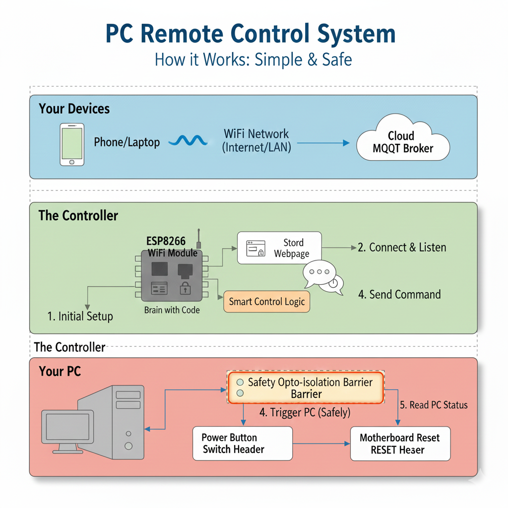

# ⚡ ESP8266 PC Control via MQTT

---

### Features

---

## 📝 Overview
This project uses **ESP8266** to control a desktop PC remotely via **MQTT**. 🚀  
هذا المشروع يستخدم **ESP8266** للتحكم في جهاز كمبيوتر مكتبي عن بُعد باستخدام **MQTT**. 💻

**Features | الميزات**:
- 🔌 Turn ON/OFF the PC - تشغيل وإيقاف الكمبيوتر  
- 🔄 Restart the PC - إعادة تشغيل الكمبيوتر  
- ⚠️ Force shutdown - إيقاف التشغيل بالقوة  
- ❌ Cancel shutdown - إلغاء إيقاف التشغيل  
- ✅ Check if PC is working (not full power monitoring) - التحقق من عمل الكمبيوتر فقط وليس مراقبة الطاقة الكاملة  

---

## 🖼️ Block Diagram

---

## ⚡ Electrical Isolation Warning
**Important:** This system interacts with desktop PC power lines.  
Do **not connect directly to mains voltage**. Use proper isolation such as **opto-isolators or relays rated for PC signals**.  

**Arabic:**  
تحذير مهم: هذا النظام يتعامل مع خطوط طاقة الكمبيوتر.  
لا تقم بالاتصال المباشر بمصدر التيار الكهربائي. استخدم عزل مناسب مثل **الريليهات أو الأوبتو-إيزولاتور** المصممة للتعامل مع إشارات الكمبيوتر.  

---

## 🌐 MQTT
MQTT setup requires IP, username, and password configuration in the code.  
يجب إعداد **IP، اسم المستخدم، وكلمة المرور** للـ MQTT في الكود.

**Topics used | المواضيع المستخدمة**:
- `PC-force` → Receive commands - استقبال أوامر التحكم  
- `PC-response` → Publish PC status - إرسال حالة الكمبيوتر  

**Commands | الأوامر**:
| Command | Description | الوصف |
|---------|------------|--------|
| `Sh` | Shutdown PC | إيقاف تشغيل الكمبيوتر |
| `Re` | Restart PC | إعادة تشغيل الكمبيوتر |
| `Fo` | Force shutdown | إيقاف التشغيل بالقوة |
| `ca` | Cancel shutdown | إلغاء عملية الإيقاف |
| `inXXXX` | Set countdown in seconds | تعيين عداد تنازلي بالثواني |

---

## 🛠️ Arduino IDE
- Use **Arduino IDE** with **ESP8266 Board** installed. 🖥️  
- استخدم **Arduino IDE** مع تثبيت لوحة **ESP8266**. 💡  

**Required libraries | المكتبات المطلوبة**:
- ESP8266WiFi  
- PubSubClient  
- EEPROM  
- ESP8266WebServer  
- ESP8266mDNS  

---

## 📌 ESP8266 Pinout
| ESP8266 Pin | Function | الوظيفة |
|------------|---------|---------|
| D5 | Power control (ON/OFF PC) 🔌 | التحكم في التشغيل (تشغيل/إيقاف الكمبيوتر) |
| D4 | Reset control 🔄 | التحكم في إعادة التشغيل |
| D13 | PC working check ✅ | التحقق من حالة الكمبيوتر |

---

## 👤 Author
**Abdelrahman Elnahrawy**  

---

## 📝 License
This project is licensed under the **MIT License**.  
هذا المشروع مرخص تحت **رخصة MIT**.  
See the [LICENSE](LICENSE) file for details.  
راجع ملف [LICENSE](LICENSE) لمزيد من التفاصيل.
