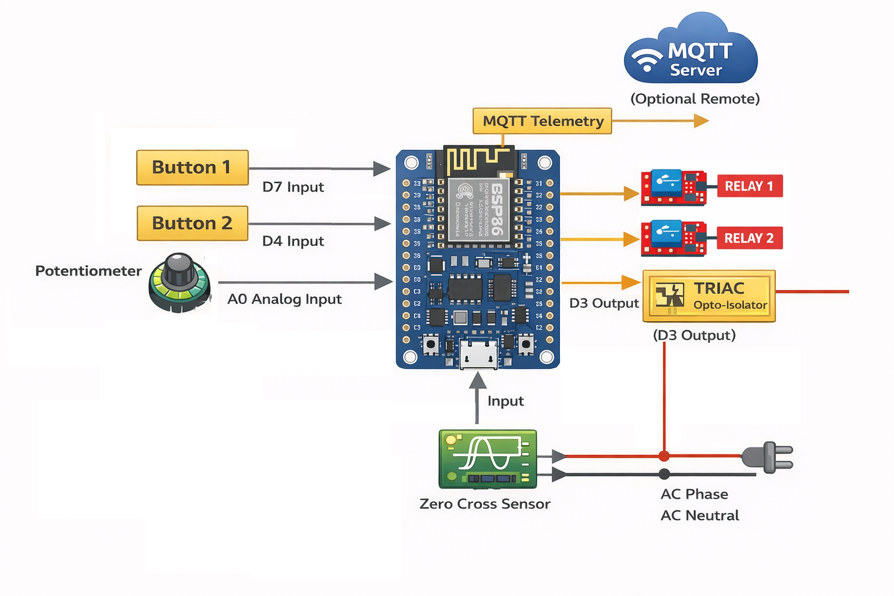

# ESP8266_SMART_DIMMER 💡⚡

  
  
  
[]  
  

---

## Description
**EN:**  
ESP8266 Smart Dimmer for AC loads with TRIAC control. Features **WiFi soft-AP configuration**, **MQTT integration**, and **potentiometer/manual override** logic. Supports zero-cross detection for safe dimming.  

**AR:**  
محكم الإضاءة الذكي ESP8266 للتحكم في الأحمال AC عبر TRIAC. يدعم إعداد الشبكة اللاسلكية عن طريق **Soft-AP**، التكامل مع **MQTT**، ومنطق **تحكم بالبوتينشوميتر/يدوي**. يدعم اكتشاف الصفر لتعتيم آمن.  

---
## Block Diagram / المخطط العام
  
> Includes TRIAC opto-isolator for safe AC load control

## Features / المميزات
- Soft-AP web portal لإعداد WiFi 🔧  
- MQTT control مع أولوية على pot عند استلام قيمة جديدة 📡  
- Potentiometer override فقط عند تغير أكثر من 100 وحدة ⚙️  
- TRIAC zero-cross detection لتشغيل آمن ⚡  
- نشر تردد zero-cross عبر MQTT 📊  
- EEPROM لتخزين بيانات WiFi 💾  

---

## Connections / التوصيلات
| ESP8266 Pin | Connection / التوصيل |
|-------------|--------------------|
| D3          | TRIAC gate         |
| D8          | Zero-cross sensor  |
| A0          | Potentiometer      |
| GND         | AC Neutral         |
| VCC         | 3.3V               |

> ⚠️ **Isolation Warning:** Always use **optocouplers/opto-isolators** between the AC line and ESP8266 circuitry. Ensure proper isolation to avoid electric shock.  

---

## How to Use / طريقة الاستخدام
1. Upload code to ESP8266  
2. If no WiFi credentials, device starts in **Soft-AP mode** with `SSID: SmartDimmer_Config`  
3. Connect to the portal and enter your WiFi SSID and password  
4. Device will connect to your WiFi and MQTT broker  
5. Adjust brightness via potentiometer or MQTT message (`0-100`)  

---

## MQTT Topics
| Topic                  | Description                 |
|------------------------|----------------------------|
| `smartdimmer/set`       | Set brightness 0-100       |
| `smartdimmer/freq`      | Reports zero-cross count   |

---

## License
MIT License © Abdelrahman Elnahrawy  
All code and design are free to use, modify, and distribute.

---

