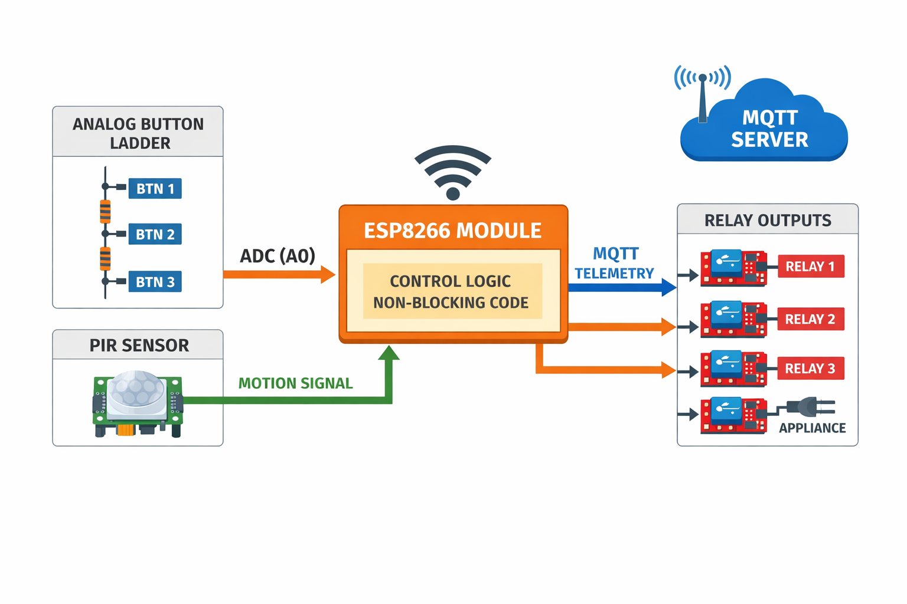

# 🎹 ESP8266 Analog Ladder Relay Hub (Simplified)


---

## 📖 Overview
The **ESP8266 Analog Ladder Relay Hub** is a **clean, reliable, and pin-efficient smart control node**.

It uses a **single analog pin ($A0$)** with a resistor ladder to detect **three physical buttons**, controls **three relays**, and reports **motion events and system state via MQTT**.

The firmware is written with a **non-blocking architecture**, making it stable for long-term IoT deployment.

---

## 🚀 Key Features
* **🎛️ Analog Button Ladder (3 Buttons):**  
  Reads multiple buttons from a single ADC pin using voltage thresholds.

* **🧠 Noise-Proof Button Detection:**  
  - ADC averaging  
  - Time-based debounce  
  - Press/release state machine  

* **🔌 3 Relay Outputs:**  
  Toggle appliances reliably via digital GPIOs.

* **👁️ PIR Motion Detection:**  
  Hardware interrupt-based motion detection with MQTT reporting.

* **📡 MQTT Telemetry:**  
  Publishes:
  - Device ID  
  - Relay states  
  - Motion events  

* **⏱️ Fully Non-Blocking:**  
  No `delay()` used — all tasks scheduled using `millis()`.

---

## 🆔 Device Identification
Each device has a unique ID defined at compile time:

```cpp
#define DEVICE_ID  101
```

This allows multiple hubs to operate on the same MQTT broker without conflicts.

---
## block diagram

## 🛠️ Hardware Architecture

### 🔘 Analog Button Ladder
Three buttons are connected through different resistor values, producing distinct ADC readings on `$A0$`.

The firmware:
- Samples the ADC
- Averages readings
- Maps values to button IDs
- Filters noise and false triggers

---

## 📌 Pin Definitions

| Component | ESP8266 Pin | Function |
|---------|-------------|---------|
| **Analog Input** | A0 | 3-Button Ladder |
| **Relay 1** | D6 | Digital Output |
| **Relay 2** | D7 | Digital Output |
| **Relay 3** | D5 | Digital Output |
| **PIR Sensor** | D4 | Motion Interrupt |

---

## 🧠 Firmware Design Notes
- PIR interrupt only sets a flag (ISR-safe)
- All logic handled in `loop()` without blocking
- Button presses detected on **release** for stability
- MQTT reconnect handled automatically

---

## 👤 Author
**Abdelrahman Elnahrawy**  
GitHub: [@Abdelrahman-Elnahrawy](https://github.com/Abdelrahman-Elnahrawy)

---

## ⚖️ License
MIT License
