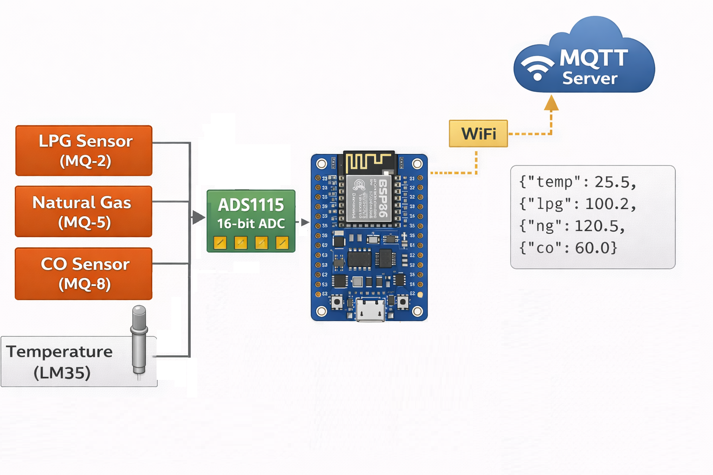

# 🌡️ Multi-Gas & Temperature Monitor (ESP8266)

[](https://www.espressif.com/en/products/socs/esp8266)  
[](https://www.arduino.cc/)  
[](http://mqtt.org/)  
[]  
[](LICENSE)

---

## 📖 Overview

This project is a **Multi-Gas & Temperature Monitor** using an **ESP8266** microcontroller and an **ADS1115 16-bit ADC** to read multiple analog sensors. It measures:

- LPG (MQ-2)
- Natural Gas (MQ-5)
- Carbon Monoxide (MQ-9)
- Temperature (LM35)

It supports:

- WiFi connectivity
- Soft-AP setup for first-time configuration
- MQTT integration for real-time monitoring
- Non-blocking sensor reading
- Kalman filtering for smooth sensor values
- EEPROM storage for WiFi and MQTT broker credentials

---
## Block Diagram / المخطط العام


> **Description:**  
> The diagram shows the ESP8266 (NodeMCU/Wemos D1 Mini) at the center connected to an ADS1115 16-bit ADC.  
> Four analog sensors are connected to the ADS1115:
> - **MQ-2** (LPG)
> - **MQ-5** (Natural Gas)
> - **MQ-9** (CO)
> - **LM35** (Temperature)  
> 
> Sensor data is read periodically, filtered via Kalman filters, and sent over **WiFi** to an **MQTT broker**.  
> The JSON payload includes temperature and gas concentrations.  
> The system supports **Hotspot mode** for initial WiFi/MQTT configuration and **Normal Operation mode** for live monitoring.

## 🔧 Features

- Reads **4 analog inputs** via ADS1115  
- Smooths sensor readings using **Kalman Filters**  
- WiFi **Soft-AP mode** for configuration without prior credentials  
- MQTT communication to publish gas and temperature data  
- Non-blocking design with adjustable **reading interval**  
- Supports reconnection logic for WiFi and MQTT  

---

## ⚙️ Hardware Connections

| Component          | ESP8266 Pin / Connection       |
|-------------------|-------------------------------|
| ADS1115 SDA        | D2                             |
| ADS1115 SCL        | D1                             |
| MQ-2 Sensor        | ADS1115 Channel 0              |
| MQ-5 Sensor        | ADS1115 Channel 1              |
| MQ-9 Sensor        | ADS1115 Channel 2              |
| LM35 Temperature   | ADS1115 Channel 3              |
| 3.3V               | VCC of ADS1115 & Sensors       |
| GND                | GND of ESP8266 and Sensors     |

> ⚠️ Ensure proper isolation for sensors connected to combustible gases.

---

## 🌐 Soft-AP Setup

1. On first boot (no stored WiFi credentials), ESP8266 enters **Hotspot Mode**  
2. Connect to SSID: `ESP8266_Gas_Setup` with password: `12345678`  
3. Open a browser and go to `http://192.168.4.1`  
4. Enter your WiFi SSID, WiFi password, and MQTT broker IP  
5. Press **Save & Restart** to store credentials and reboot  

---

## 📡 MQTT Integration

- **Publish Topic:** `environment/data`  
- **Subscribe Topic:** `environment/control`  

**Sample JSON published:**

```json
{
  "temp": 25.5,
  "lpg": 100.2,
  "ng": 120.5,
  "co": 60.0
}
```
Notes:

MQTT messages can be used to control device logic or request current readings

Device will reconnect automatically if WiFi or MQTT connection drops

##🖥️ Software / Libraries
ESP8266WiFi
ESP8266WebServer
PubSubClient
EEPROM
SimpleKalmanFilter
Adafruit_ADS1X15

##📊 Calibration & Notes
Adjust the scaling equations in the code for each gas sensor according to your calibration

LM35 outputs 10mV per °C, multiplied by 100 in the code for Celsius

##👤 Author
Abdelrahman Elnahrawy
GitHub: @Abdelrahman-Elnahrawy

##⚖ License
MIT License - free to use, modify, and distribute.


If you want, I can **also create a small block diagram image** for this gas monitor with **ESP8266, ADS1115, sensors, WiFi, and MQTT arrows** so you can include it in the README.  

Do you want me to make that image too?